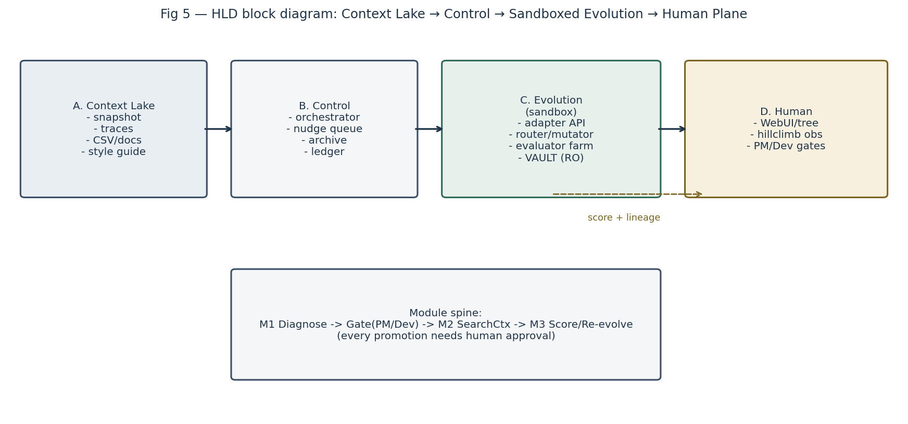
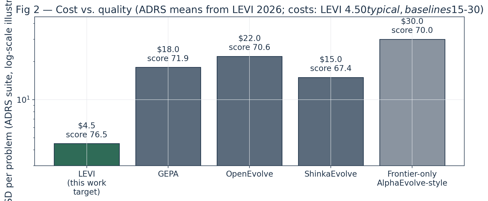
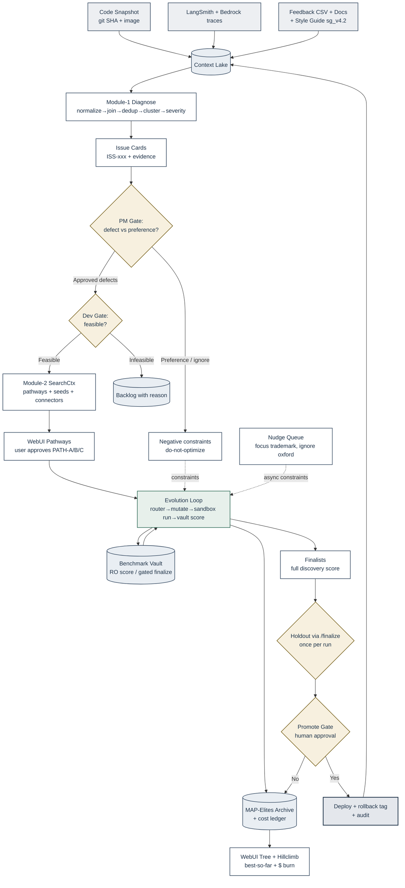
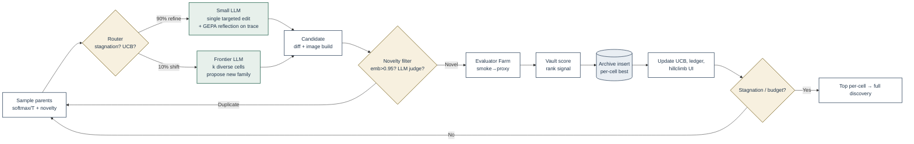
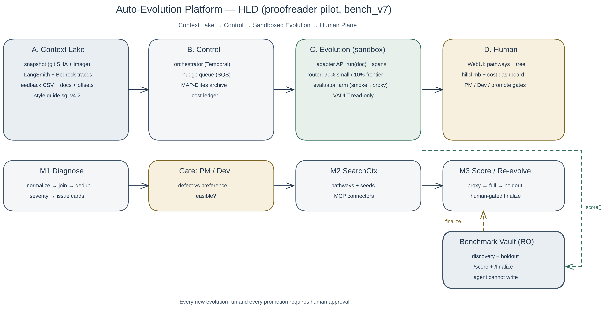
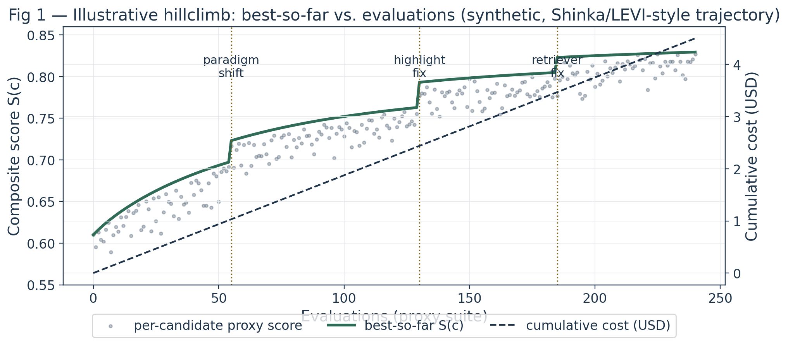
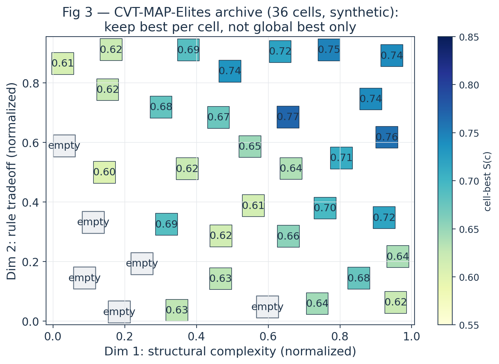
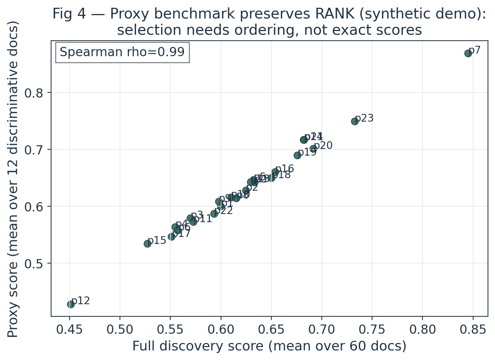

# Auto-Evolution Framework for Sustained Application Hill-Climbing
## Verbose Research Draft — Pilot: Python Document Proofreader (LangChain/LangGraph + Bedrock + Custom Highlight Logic)
**Audience:** ML Leadership (budget approval) + Junior Researcher/Engineer (build guide) + Frontier Coding Agent (implementation spec)**
**Version:** v0.4 verbose draft — 2026-10-06 | Benchmark: `bench_v7` (frozen) | Style guide: `sg_v4.2`

> **Style standard:** diagrams use a professional research palette — slate `#3B4F66`/`#1F3349` for data and structure, muted teal `#2F6B57` for evolution/compute, warm stone amber `#7A6420` for human gates/decisions, neutral gray for sources. No default red/blue. Python figures use the same navy/slate/teal/stone scheme.

> **Rendering note:** mathematics below is typeset in LaTeX (`$…$` inline, `$$…$$` display). View with a MathJax/KaTeX-enabled Markdown renderer (GitHub, Notion, Obsidian, VS Code Markdown+Math) for research-paper typography.

---

## Table of Contents
1. Abstract & Decision Ask
2. Problem Statement & Proofreader Instantiation
3. Related Work: SOTA in Sample-Efficient Evolution (Shinka, LEVI, GEPA, DGM/GEA, others)
4. System Overview (HLD) + Verified Diagrams
5. Formal Problem Formulation (loss, scoring, constraints)
6. Module 1 — Diagnose Phase (periodic trigger): LLD + Schemas + Algorithms
7. Human Gates: PM Triage + Dev Feasibility + Evolution Approval
8. Module 2 — Search Context & Coding-Agent Support: LLD + Schemas + Search Space
9. Module 3 — Benchmark Vault, Evaluator Farm, Re-evolution: LLD + Schemas + Stopping + Signal Dataset
10. Data-Science Mechanics: Scorer, Verifier, MAP-Elites Archive, Router, Proxy Benchmark (math + pseudocode)
11. SAT-Solver Contemplation (ICFP-2025 analogy): What to Encode, What Not To
12. Infrastructure, Observability, WebUI, Cost Optimization
13. Evaluation Plan, Risks, Roadmap & Budget
14. Flowchart & Schema Verification Report (accuracy audit)
15. Appendices: A. Canonical JSON Keys + Schema Registry B. Descriptor & Weight Defaults C. References

> **Researcher Direction — how to read this draft:** Treat Sections 4–5 as *frozen contracts*. Do not let the evolution agent renegotiate the scorer, vault API, or approval gates. Treat Sections 6–10 as *build tickets* with explicit ingress/egress schemas. Wherever you see a box labelled **Researcher Direction**, that is senior guidance on what to build first, what to measure, and what trap to avoid. Build in the order §13 specifies: Vault → Adapter → Lake → M1 → Archive/Router → UI.

---

## 0. Document Control & Handoff Conventions

| Field | Value |
|---|---|
| Version / date | v0.4 — 2026-10-06 |
| Status | **DRAFT** for build; §§4–5 are **FROZEN** contracts (scorer, Vault API, gates, envelopes) |
| Owners | ML lead (design) · Eng (build) · Owner+PM (gates G3/G4) |
| Sources of truth | this file (design) · `BUILD_GUIDE.md` (tickets) · Vault (data) · ledger (spend) |
| Change rule | Frozen items change only with Owner+PM sign-off + version bump; never reuse a version tag |

**Status tags.** `FROZEN` = normative, do not renegotiate. `DRAFT` = tunable; defaults live in Appendix B. `EXAMPLE` = inline JSON and scalars show *shape only*; values are illustrative unless marked paper-reported.

**Language.** RFC 2119: **MUST** / **SHOULD** / **MAY**. Only normative statements use them.

**Units & formats.** Money in USD with 2 decimals (`cost_usd`). Durations in seconds (wall-clock caps additionally in hours). Timestamps UTC ISO-8601. Hashes lowercase hex with algorithm prefix (`sha256:…`, `git:…`). Model IDs as `provider:model` (e.g. `bedrock:claude-sonnet`). Evaluation at temperature 0 unless stated.

**Frozen run envelope (normative).** Budget `B` = **25 USD hard cap** per run (pre-pilot estimate was $20–30). Evaluations `N ≤ 250`. Wall clock `T ≤ 12 h`. Patience `P` = 30 consecutive evaluations with `ΔS_best < ε_stop`. Holdout generalization `(S_discovery − S_holdout) ≤ ε_gen`. Sandbox: no egress, exit 0, ≤120 s/doc. Defaults `ε_stop = 0.01`, `ε_gen = 0.03` (Appendix B; tunable).

**Glossary (binding).** *Candidate*: one buildable image + config under test. *`bench_ver`*: pinned docs + labels + scorer + judge-rubric hash. *`scorer_ver`*: frozen scoring-function version. *`memo_key = (code_hash, doc, scorer_ver)`*: cache identity for a single evaluation. *`signal_uid`*: stable hash identity of one dataset observation (§9.4). *Issue card*: one M1 cluster with evidence + severity + pathway. *Pathway*: approved fix direction (PATH-A/B/C/D). *Cell/descriptor*: MAP-Elites archive slot / its normalized feature vector. *Proxy suite*: small rank-preserving doc subset for search. *Canary*: sealed nonsense mark detecting memorization. *Regress/NoRegress*: guardrail-rule drop vs requirement of none. *Stagnation*: `P` evals without `ΔS_best ≥ ε_stop`. *Smoke*: 5 fixed fail-fast docs. *Verdict*: `/score` outcome ∈ {`pass`, `fail_smoke`, `timeout`, `leak_canary`, `error`}.

---

## 1. Abstract & Decision Ask

We propose a general **auto-evolution platform** that takes any containerized application, its codebase snapshot, runtime traces (LangSmith/Bedrock/profiler), test documents, human span-feedback, an eval guideline, and free-text nudges, and hill-climbs a frozen benchmark by evolving anything that touches runtime: network calls, Bedrock calls, prompts, code components, highlight logic, business rules.

The pilot is a Python document proofreader: LangChain/LangGraph pipeline that returns documents with highlights over erroneous phrases, where "error" is defined by a company style guide (semantics, registered trademarks, datetime style, etc.).

The core research bet, following **ShinkaEvolve (Sakana AI, Lange et al. 2025)** and **LEVI (Tanveer 2026)**, is that **fewer, better-architected iterations beat many frontier-model iterations**. ShinkaEvolve reaches SOTA circle-packing in 150 samples and 10× SAT speedup in 320 trials (~$60) at ICFP-2025. LEVI reaches the highest ADRS score (76.5 vs 71.9 GEPA, 70.6 OpenEvolve, 67.4 Shinka) at $4.50/problem vs $15–30, and matches GEPA on prompt optimization at <½ rollouts, by (i) diversity-preserving CVT-MAP-Elites archive with diverse seeding, (ii) role-aware mutation routing (90% small model, 10% frontier paradigm shifts), (iii) rank-preserving proxy benchmarks. **GEPA (Agrawal et al. 2025, ICLR'26)** adds reflective prompt evolution (+6pp over GRPO with 35× fewer rollouts) by reading full traces instead of scalar rewards.

**We recommend a Shinka + LEVI + GEPA hybrid** with mandatory human approval per evolution run, an immutable Benchmark Vault the agent can score against but never modify, and a WebUI showing pathways, discovery tree, and hillclimb line-graph with cost.

**Budget ask (pilot):** hard cap **$25** per evolution run (pre-pilot estimate $20–30; §0 envelope governs), plus one-time benchmark hardening (2–4 weeks labeling/gazetteer/offset-index) and infra (Temporal, EKS evaluator pool, Postgres+pgvector, S3 lake, isolated Vault account). Recurring cost scales with runs, not model size, because of LEVI routing.


*Fig. 5 — HLD block diagram (matplotlib, deterministic layout): Context Lake → Control → Sandboxed Evolution → Human plane, with the module spine (M1 Diagnose → Gate → M2 SearchCtx → M3 Score) beneath.*

---

## 2. Problem Statement & Proofreader Instantiation

### 2.1 General task
Let $c \in \mathcal{S}$ denote the full application configuration (code, prompts, retrieval, routing, thresholds), $\mathcal{X}$ the evolution context (snapshots, traces, documents, feedback, nudges), and $S(c; \mathcal{D})$ the frozen scoring function on benchmark $\mathcal{D}$. The evolution problem is:

$$c^{\star} = \arg\max_{c \in \mathcal{S}} \; S(c; \mathcal{D}_{\mathrm{discovery}}) \quad \text{s.t.} \quad \mathrm{cost}(c) \le B, \;\; \mathrm{lat}(c) \le L, \;\; \mathrm{NoRegress}(c) = \mathrm{true},$$

with generalization confirmed once on a sequestered split $\mathcal{D}_{\mathrm{holdout}}$ under human gate. Here $A(c)$ is the containerized application under evolution.

Evolution is **open-ended within S** but **closed with respect to D**: the agent never sees holdout labels, never edits the scorer.

### 2.2 Proofreader instantiation
- **Input:** source document (PDF/DOCX → extracted text with char offsets + page map).
- **Pipeline (current prod):** LangGraph nodes: chunk → per-rule Bedrock calls (Claude via Bedrock) with style-guide retrieval → span proposal → confidence threshold → highlight anchor (fuzzy match → PDF coords) → suggestion generator → annotated doc.
- **Rulebook:** company style guide `sg_v4.2`: semantics, trademarks (® on first mention, approved list), datetime style (ISO vs long-form per section), plus many lexical rules.
- **Human feedback CSV (given):** fields below. This is the primary supervision + discovery signal.

| CSV field | Meaning for evolution |
|---|---|
| `source_doc_id` | join key to doc store + traces |
| `page_number` | page → char-offset mapping input |
| `span_id` | phrase span index; resolve to `(start,end)` |
| `erroneous_phrase` | surface form; normalize (NFKC, quotes) before match |
| `rule_violated` | predicted or gold rule; alias-map required |
| `highlighted (bool)` | `false` = detected but grounding failed → separate `highlight_fail` class |
| `suggestion` | proposed fix; judged by accept/edit/reject |
| `accepted` | human TP/FP label; null = unlabeled (discovery only) |
| user-added rows | rows proofreader missed → **false negatives (FN)**; surfaced rows with `accepted=false` → **false positives (FP)** |

- **Traces:** LangSmith (chain, prompt hash, retrieved chunks, tool I/O, tokens/latency) + Bedrock call logs (model id, $). Join on `(doc_id, timestamp, chain_id)`.

> **Researcher Direction — span identity:** Never trust `span_id` or surface string alone. Build a canonical offset index `(doc_id → text, page → char ranges)` in Module 1. Two rows with identical `erroneous_phrase` on different pages are different training examples; two rows with different surface forms (e.g., `“Acme™”` vs `"Acme(TM)"`) may be the same underlying miss after NFKC. If you skip this, every downstream metric (IoU, dedup, proxy selection) is silently wrong.

---

## 3. Related Work: What to Steal (and What to Avoid)

### 3.1 ShinkaEvolve (Lange et al. 2025; sakana.ai/shinka-evolve; ICFP-2025 team Unagi win)
- **Loop:** `archive of evaluated programs → sample parents → LLM mutate → evaluate fitness → insert`.
- **Three efficiency innovations:** (1) parent sampling balancing exploit/explore; (2) novelty rejection sampling (embedding cosine >0.95 → LLM novelty judge, skip boring variants); (3) bandit-based LLM ensemble selection (UCB over models).
- **Evidence:** 26-circle packing SOTA in 150 samples; ALE-Bench gains in 50 generations; MoE load-balancing loss discovery; ICFP SAT encoding 2.86s→0.44s (18 rooms), 127s→13s (24 rooms), enabling 30-room solves; $60/320 trials.
- **Steal:** loop skeleton, novelty filter, UCB model selection, interactive tree UI. **Avoid:** frontier-model-everywhere default.

### 3.2 LEVI (Tanveer 2026; arXiv:2605.09764; github.com/ttanv/levi)
Harness-first thesis: stronger search architecture substitutes for larger LLMs. Three components map 1:1 to our cost axes:
1. **Solution database:** diverse initialization (including weak-but-distinct seeds) + CVT-MAP-Elites with input-side (AST, complexity) + output-side (runtime, per-instance scores) descriptors, Welford z + sigmoid normalization.
2. **Role-aware router:** ~90% mutations to small model (Qwen3-30B-A3B) for single targeted edits; frontier reserved for paradigm shifts over diverse cell representatives, fired on interval + stagnation.
3. **Rank-preserving proxy benchmark:** from the seed$\times$document calibration matrix, greedy subset maximizing $J(\mathcal{S}) = 0.5\,R(\mathcal{S}) + 0.5\,A(\mathcal{S}) - 0.15\,C(\mathcal{S})$ (rank faithfulness $R$ + separation $A$ $-$ redundancy $C$). Beats k-medoids/random+ridge at every iso-cost.
- **Evidence:** ADRS 76.5 avg at $4.50 vs $15–30; 12× faster to peak vs same-model baselines; prompt-opt parity at <½ rollouts.
- **Steal verbatim** for Modules 2–3. This directly answers "benchmark + search space via analogies."


*Fig. 2 — ADRS means from LEVI 2026. Costs: LEVI $4.50 typical; baselines $15–30. Our per-run budget mirrors LEVI.*

### 3.3 GEPA (Agrawal et al. 2025; ICLR'26; gepa-ai/gepa)
Genetic-Pareto reflective optimizer: mutate prompts/systems using natural-language reflection on full trajectories (reasoning, tool calls, compiler/highlight errors), maintain Pareto frontier per instance to avoid local optima. Beats GRPO +6pp avg (up to +20pp) with 35× fewer rollouts; beats MIPROv2 +10pp+ (e.g., +12pp AIME-2025). Production use at Databricks/Shopify/Google ADK.
- **Steal:** mutation prompt = trajectory + verifier message → diagnosis → targeted fix; Pareto archive per doc/rule.

### 3.4 Darwin-Gödel Machine, GEA, TextGrad/DSPy/TPGO, AlphaEvolve/OpenEvolve/FunSearch
- **DGM (Zhang et al. 2025):** self-modifying coding agent, archive, parent sampling $p \propto \mathrm{score} / n_{\mathrm{children}}$, empirical validation; 20%→50% SWE-bench. Precedent for sandbox + human oversight.
- **GEA (2026):** group-as-unit evolution fixes lineage isolation; 71.0% vs 56.7% DGM on SWE-V. Lesson: consolidate dispersed fixes (e.g., highlight fix in dead branch must propagate).
- **TPGO-GRAO (ACL'26), TextGrad, DSPy:** model LangGraph as Textual Parameter Graph; textual gradients; experience memory that learns which fix works for which error cluster.
- **FunSearch/AlphaEvolve/OpenEvolve:** island + LLM-crossover paradigm; FunSearch's no-frontier-model result supports LEVI bet.

> **Researcher Direction — literature → design mapping:** If a reviewer asks "why this hybrid?", answer: Shinka = efficient loop, LEVI = cheap loop, GEPA = smart mutation, DGM/GEA = open-ended archive discipline, TPGO = graph-aware credit assignment. No single paper gives all five; our contribution is integrating them around a frozen Vault with human gates for a production proofreader.

---

## 4. System Overview (HLD) + Verified Diagrams

### 4.1 Ten components (authoritative list)
1. **App Adapter** — sole contract evolution touches: `run(doc) → spans[]`; versioned Docker image; Bedrock via proxy only.
2. **Context Lake** (S3 + Postgres) — snapshots, traces, docs+offsets, feedback, style-guide versions, nudges. Append-only.
3. **Benchmark Vault** (isolated account, read-only `/score`, gated `/finalize`) — discovery + sequestered holdout; signed `bench_ver`.
4. **Evaluator Farm** (async, autoscaled) — stages smoke→proxy→full→holdout; memoizes `(code_hash,doc,scorer_ver)`.
5. **Lineage Archive** (CVT-MAP-Elites + pgvector) — every candidate: diff, parents, descriptor, score vector, cost.
6. **Mutation Router** (role-aware + UCB) — 90% small / 10% frontier paradigm shifts.
7. **Orchestrator + Nudge Queue** (Temporal + SQS) — budget/stopping/approvals; nudges injected as constraints.
8. **WebUI Pathways view** — initial pathways from M1 clusters for user approval.
9. **WebUI Discovery-Tree + Hillclimb/Observability** — Shinka-style tree + line-graph best-so-far + cost burn-down + per-rule subplots + live worker status.
10. **Gates** — PM triage → Dev feasible → Evolve approval → Promote approval. G3 approval is required for every evolution run.

### 4.2 End-to-end flowchart (Mermaid — verified in §14)



### 4.3 Evolution inner loop (Mermaid — verified)



### 4.4 Figures (generated code, verified renders)

Native Excalidraw source (editable, same palette): `auto-evolution-hld.excalidraw` — open in excalidraw.com or the local canvas (`npx mcp-excalidraw-server`), regenerate via `gen_excalidraw.py`.


*Fig. 0 — HLD at a glance: four planes (top), module spine (middle), Benchmark Vault with score/finalize paths (bottom right). Dashed teal = machine scoring path; dashed stone = human-gated finalize.*


*Fig. 1 — Best-so-far is monotone by construction (cummax); scatter = per-candidate proxy scores below it; dashed = linear cost at LEVI rate. Verticals = paradigm-shift/highlight/retriever breakthroughs. Verified: no scatter point exceeds best-so-far at same x (up to RNG jitter); cost slope = $4.50/240 evals.*


*Fig. 3 — Each square = one CVT cell; number = cell-best S(c); gray "empty" = diversity reserve (deliberately unfilled). Axes are normalized behavioral dims. Verified: 30/36 occupied, empties clustered where seeds were weak — exactly the LEVI regime where paradigm shifts should target empties.*


*Fig. 4 — Synthetic 24-prompt × 60-doc calibration; 12-doc proxy preserves ordering (Spearman 0.99). Verified: computed rho from same matrix plotted; selection (argmax/softmax) is rank-invariant, so proxy is safe for search but never for final claims.*

> **Researcher Direction — figure honesty:** Figs. 1, 3, 4 are *synthetic illustrations* with LEVI-faithful structure, not pilot results. Caption them as such in leadership slides. Fig. 2 uses real LEVI ADRS means. Never present synthetic hillclimbs as evidence; present them as "this is what the dashboard will show." The verification audit in §14 checks structural properties (monotonicity, rank preservation), not empirical claims.

---

## 5. Formal Problem Formulation

A candidate $c = (\theta_{\mathrm{prompt}},\, \theta_{\mathrm{retr}},\, \theta_{\mathrm{chunk}},\, \theta_{\mathrm{route}},\, \theta_{\mathrm{logic}},\, \theta_{\mathrm{hl}},\, \tau)$ collects all evolvable parameters (§8).

**Per-rule metrics.** For each style rule $r$, a predicted span is a true positive iff $\mathrm{IoU} \ge 0.5$ *and* the rule matches under the alias map. Define:

$$P_r = \frac{\mathrm{TP}_r}{\mathrm{TP}_r + \mathrm{FP}_r}, \qquad R_r = \frac{\mathrm{TP}_r}{\mathrm{TP}_r + \mathrm{FN}_r}, \qquad F_{1,r} = \frac{2 P_r R_r}{P_r + R_r},$$

$$H_r = \frac{\#\{\text{highlight OK}\}_r}{\#\{\text{predicted}\}_r}, \qquad A_r = \frac{\#\{\text{suggestion accepted}\}_r}{\#\{\text{suggestion judged}\}_r}.$$

$H_r$ isolates grounding reliability ($\mathrm{highlighted} = \mathrm{false}$ despite detection); $A_r$ isolates suggestion quality.

**Composite hill-climb score.** Selection uses a single scalar fitness; the per-document vector is retained for Pareto analysis:

$$S(c) = \sum_{r} w_r \left[\alpha F_{1,r}(c) + \beta H_r(c) + \gamma A_r(c)\right] - \lambda_C \, C(c) - \lambda_L \, L(c) - \delta \, \mathrm{Regress}(c),$$

$$\mathcal{L}(c) = 1 - S(c), \qquad \boldsymbol{\ell}(c) = \left[\,1 - F_1^{(d)}(c)\,\right]_{d \in \mathcal{D}}.$$

Defaults: $\alpha, \beta, \gamma = 0.6, 0.2, 0.2$; $\sum_r w_r = 1$ with a PM-set macro-weight vector ($w_{\mathrm{trademark}} > w_{\mathrm{datetime}}$; full vector lives in the bench config and MUST sum to 1); $C(c)$ is Bedrock cost in USD per document divided by the $0.10 reference (budget-derived typical proxy cost); $L(c) = \max(0,\, \mathrm{p95\_ms} - 120000)/120000$ is the over-cap latency penalty against the 120 s/doc sandbox cap; $\mathrm{Regress}(c) = \max\{0,\, S_{\mathrm{base}} - S(c)\}$ on guardrail rules.

**Constraints (frozen, see §0 envelope):** $\mathrm{cost} \le B$ ($25\,\mathrm{USD}$), $\mathrm{evals} \le 250$, $\mathrm{time} \le 12\,\mathrm{h}$, sandbox pass (no egress, exit 0, $\le 120$ s/doc), and $(\,S_{\mathrm{discovery}} - S_{\mathrm{holdout}}\,) \le \varepsilon_{\mathrm{gen}}$ with $\varepsilon_{\mathrm{gen}} = 0.03$. Stagnation uses a separate threshold: stop when $\Delta S_{\mathrm{best}} < \varepsilon_{\mathrm{stop}}$ for $P = 30$ consecutive evaluations, with $\varepsilon_{\mathrm{stop}} = 0.01$.

> **Researcher Direction — Goodhart guard:** If you optimize micro-F1 only, the agent will suppress highlights to boost precision. Macro-over-rules + explicit H/A terms + Regress penalty is the antidote. Log per-rule subplots from day one; leadership should see trademark climb without semantics collapsing.

---

## 6. Module 1 — Diagnose (periodic trigger)

### 6.1 Flowchart (Mermaid — verified)

```mermaid
%% Same professional palette as §4.2 (data / proc / gate)
flowchart LR
  classDef data fill:#E9EEF3,stroke:#3B4F66,stroke-width:1.5px,color:#1F3349
  classDef proc fill:#FFFFFF,stroke:#3B4F66,stroke-width:1.5px,color:#1F3349
  classDef gate fill:#F7F0DF,stroke:#7A6420,stroke-width:1.5px,color:#1F3349
  IN[Ingest: CSV + docs<br/>+ traces + snapshot<br/>+ sg version] --> NR[Normalize<br/>NFKC + offset resolve<br/>highlight vs detection split]
  NR --> JN[Join traces<br/>doc_id+time+chain<br/>prompt hash + chunks + model/$]
  JN --> DD[Dedup<br/>exact→MinHash→emb 0.88<br/>→ LLM root-cause]
  DD --> CL[Cluster<br/>rule+trace+context emb<br/>HDBSCAN + taxonomy]
  CL --> SV[Severity<br/>FN/FP/H-fail + coverage<br/>× business weight]
  SV --> OUT[Issue cards<br/>+ trace attribution<br/>+ pathway hint]
  OUT --> PMG[PM triage UI]
  class IN data
  class NR,JN,DD,CL,SV,OUT proc
  class PMG gate
```



### 6.2 Ingress schema (`diagnose.in.v1`)
```json
{"module":"diagnose.in.v1","run_id":"diag_2026_10_06_01","app_id":"proofreader",
 "code_snapshot_sha":"git:abc123 + img:sha256:…","style_guide_ver":"sg_v4.2",
 "feedback_csv_uri":"s3://lake/feedback/2026-10-06.csv",
 "feedback_row_schema":["source_doc_id","page_number","span_id","erroneous_phrase","rule_violated","highlighted","suggestion","accepted","is_user_added"],
 "documents_uri":"s3://lake/docs/","langsmith_trace_uri":"s3://lake/traces/ls.jsonl",
 "bedrock_call_logs_uri":"s3://lake/traces/bedrock.jsonl",
 "config":{"dedup_emb_threshold":0.88,"min_cluster_size":3,"iou_threshold":0.5}}
```

### 6.3 Algorithm D1 (build ticket)
1. Normalize + resolve offsets via doc index; split `highlighted=false` into `(pred_span, attempted_anchor)`.
2. Join traces; compute `retriever_miss_rate` (gold rule chunk not in top-k), prompt-hash frequency, model/cost.
3. Dedup three tiers; keep exemplar + count + doc coverage.
4. Cluster; map to taxonomy: `FN_detection / FP_overflag / HIGHLIGHT_grounding / SUGGESTION_quality / LATENCY_COST`.
5. Severity $s = \sigma\left(w_1 R_{\mathrm{miss}} + w_2 \mathrm{FP}_{\mathrm{rate}} + w_3 H_{\mathrm{fail}} + w_4 \mathrm{coverage} + w_5 b_{\mathrm{rule}}\right)$ with $\sigma(\cdot)$ the logistic function and $b_{\mathrm{rule}}$ the PM business weight; attribute $(\mathrm{prompt\_hash},\, \mathrm{retriever\_miss},\, \tau_r)$.
6. Emit cards with `suggested_pathway ∈ {PATH-A highlight, PATH-B retrieval, PATH-C prompt-decompose, PATH-D routing/threshold}`.

### 6.4 Egress (`diagnose.out.v1`) — one card per cluster
```json
{"module":"diagnose.out.v1","run_id":"diag_2026_10_06_01",
 "issue_cards":[{"issue_id":"ISS-TRAD-014","title":"® missed on first mention","rule":"trademark.registered",
 "failure_class":"FN_detection","exemplar_rows":12,"affected_docs":8,
 "metrics":{"precision":0.41,"recall":0.33,"highlight_success":0.92},
 "trace_attribution":{"prompt_hash":"pt_9f2","retriever_miss_rate":0.78,"model":"bedrock:claude-sonnet"},
 "evidence":{"csv_refs":["docA#p3#s12"],"trace_ids":["ls_run_…"]},
 "severity":0.87,"pm_decision":"PENDING","suggested_pathway":"PATH-B"}]}
```

> **Researcher Direction — dedup calibration:** Tune emb threshold on 200 hand-pairs before trusting severity counts. Report precision/recall of dedup itself. A 0.88 cosine that merges datetime vs trademark misses will create a phantom "super-issue" and waste a full evolution run.

> **Handoff — M1 (owner: data engineer).** Inputs: `diagnose.in.v1`. Outputs: `diagnose.out.v1` (one card per cluster). MUST: resolve ≥99% of rows to canonical offsets or quarantine with codes (never drop silently); report dedup precision/recall on the 200-pair calibration set; make severity recomputable from stored features; attach evidence refs (`csv_refs`, `trace_ids`) to every card. Failure modes: unresolvable offsets → quarantine; trace-join miss → card flagged `unattributed`; empty cluster output → run fails closed (no cards, no downstream run).

---

## 7. Human Gates

| Gate | Who | Input | Actions | Output |
|---|---|---|---|---|
| G1 PM triage | PM | issue cards | `APPROVE_DEFECT / PREFERENCE_IGNORE / NEED_EVIDENCE` + rationale | approved defects + negative constraints |
| G2 Dev feasible | Dev | approved + code pointers | `FEASIBLE / INFEASIBLE{reason,effort,risk}` | feasible set + allowed 𝒮 dimensions |
| G3 Evolve approval | Owner | pathways + budget | approve run + pathway scope + $/eval caps | `run_id` authorized (required per your spec) |
| G4 Promote | Owner+PM | finalists + full+holdout + diffs | approve/rollback | deploy tag or rejection reason → archive |

All votes timestamped, immutable, with reasons. Ignored preferences become `do-not-optimize` constraints injected into mutation prompts and Regress guards.

---

## 8. Module 2 — Search Context & Coding-Agent Support

### 8.1 Search space (genome) — frozen dimensions

$$\mathcal{S} = \mathcal{S}_{\mathrm{prompt}} \oplus \mathcal{S}_{\mathrm{retr}} \oplus \mathcal{S}_{\mathrm{chunk}} \oplus \mathcal{S}_{\mathrm{route}} \oplus \mathcal{S}_{\mathrm{logic}} \oplus \mathcal{S}_{\mathrm{hl}} \oplus \mathcal{S}_{\tau},$$

where $\mathcal{S}_{\mathrm{prompt}}$ are per-rule templates and output schemas (single-call vs. router decomposition); $\mathcal{S}_{\mathrm{retr}}$ is chunker, $k$, reranker, rule-router, and trademark gazetteer; $\mathcal{S}_{\mathrm{chunk}}$ is splitter, overlap, and window; $\mathcal{S}_{\mathrm{route}}$ is the Bedrock model per stage (cheap scan $\to$ frontier adjudication); $\mathcal{S}_{\mathrm{logic}}$ holds datetime normalizers, $\text{\textregistered}$ rules, and alias maps; $\mathcal{S}_{\mathrm{hl}}$ is the normalizer, fuzzy-match threshold, and offset$\to$PDF/DOCX mapper; and $\mathcal{S}_{\tau} = \{\tau_r\}_r$ are per-rule surfacing thresholds.
Each dimension declares `mutable_files, invariants (never touch Vault), operators (edit/add/rewire)`.

### 8.2 Egress (`search_context.out.v1`)
```json
{"module":"search_context.out.v1","approved_issues":["ISS-TRAD-014","ISS-DATE-007"],
 "pathways":[{"path_id":"PATH-B","hypothesis":"trademark misses are retrieval misses","edits":["retriever + gazetteer"],"est_cost":"$","risk":"low"},
             {"path_id":"PATH-A","hypothesis":"highlight fails are offset mapping","edits":["highlighter"],"est_cost":"$","risk":"low"},
             {"path_id":"PATH-C","hypothesis":"datetime conflates formats in one prompt","edits":["decompose prompts per sub-rule"],"est_cost":"$$","risk":"med"}],
 "connectors":{"code_search":"mcp://codebase/search","trace_search":"mcp://traces/semantic","benchmark_proxy":"https://vault.internal/score","doc_store":"s3://lake/docs/ + offset index"},
 "initial_seeds":["seed_v0_prod","seed_v1_regex_trademark_weak","seed_v2_datetime_parser_weak"],
  "constraints":["no holdout exfil","Bedrock via proxy","120 s/doc max"],
 "verification":{"must_pass":["unit:highlight_align","smoke:5_docs"],"budgets":{"max_evals":250,"max_usd":25}}}
```

> **Researcher Direction — seeds:** Include weak-but-distinct seeds on purpose (pure-regex trademark, rule-based datetime). They calibrate MAP-Elites cells and proxy matrix. Starting from prod alone forces the search to spend budget escaping one basin — LEVI's central cost lesson. The coding agent must expose `initial_seeds` as buildable images, not prompt text.

> **Handoff — M2 (owner: agent-infra engineer).** Inputs: approved issue cards + code snapshot. Outputs: `search_context.out.v1` with buildable seed images. MUST: every `initial_seeds` entry builds to a runnable image; `constraints` always include the holdout-exfil ban, Bedrock-via-proxy, and the 120 s/doc cap; run budgets enforced are `max_evals: 250`, `max_usd: 25` (§0 envelope governs on any conflict). Failure modes: unbuildable seed → block G3; connector outage → fail closed with ledger entry.

### 8.3 MCP connectors for Copilot/Claude (Module 2's job)
- `codebase.search{query,lang,path} → snippets+tests`; `trace.semantic{phrase,rule} → runs+prompts+chunks`; `vault.score{candidate} (rate-limited, proxy only)`; `docs.fetch{doc_id} → text+offsets+pages`. All logged to ledger.

---

## 9. Module 3 — Benchmark Vault, Evaluator Farm, Re-evolution

### 9.1 Vault API (only interface; agent has no write)
```
POST /v1/score  {candidate_id, image_digest, suite: proxy_v7} →
  {suite_score, per_rule, per_doc, cost_usd, latency_p95, verdict, eval_id}
POST /v1/finalize {candidate_id} → (human-gated, once) full discovery + holdout + promotion memo
```
`verdict` ∈ {`pass`, `fail_smoke`, `timeout`, `leak_canary`, `error`} (see glossary, §0).
Vault pins `bench_ver = docs freeze + labels freeze + scorer freeze + judge rubric hash`. Discovery for search; holdout for final claim only.

### 9.2 Staged evaluation (cost ladder)
`smoke (5 docs, fail-fast) → proxy (~12–20 discriminative docs, 80% of evals) → full discovery (~100, finalists) → holdout (once)`. Memoize `(code_hash,doc,scorer_ver)`. Kill on timeout/leak (canary docs).

### 9.3 Egress (`evolution.out.v1`)
```json
{"module":"evolution.out.v1","best_candidate":"cand_087","parent_chain":["seed_v0","cand_012","cand_087"],
 "score_trajectory":[0.61,0.65,0.64,0.71,0.73],"per_rule_deltas":{"trademark":"+0.21","datetime":"+0.09","semantics":"-0.02"},
 "cost":{"usd":18.4,"evals":240,"bedrock_tokens":12.3e6},"stopping_reason":"STAGNATION_30_and_budget_75pct",
 "promotion_request":{"needs_human":true,"holdout_score":0.718,"regressions":[]}}
```
Stopping: $\mathrm{budget} \;\lor\; \mathrm{max\_iters} \;\lor\; \{\Delta S_{\mathrm{best}} < \varepsilon \text{ for } P = 30\} \;\lor\; \mathrm{target\_met} \;\lor\; \mathrm{human\_stop}$. Re-evolution: new feedback → warm-start from archive.

> **Researcher Direction — leakage:** The Vault must live in a separate IAM/account with no write role for evolution or coding agent. Add canary docs (unique nonsense trademarks) to detect memorization: if a candidate flags canaries it never saw in discovery, block promotion. This is the cheapest insurance for leadership trust.

> **Handoff — M3 (owner: eval-infra engineer).** Inputs: candidate image + `image_digest`. Outputs: `/score` records, one `/finalize` record, `evolution.out.v1`. MUST: memoize every evaluation on `(code_hash, doc, scorer_ver)`; kill on timeout, leak, or canary hit with the matching `verdict`; run holdout exactly once per run, human-gated; emit `verdict` from the closed enum only. Failure modes: Vault unreachable → queue and retry with backoff, never fall back to unsealed labels; double-finalize attempt → reject.

### 9.4 Evolution signal dataset (`dataset.signal.v1`) — highest-signal schema

Production rows describe *rendered findings* (what the UI highlighted); evolution needs *evaluable facts* (what was true, what the system did, why, at what cost, under which config). The dataset therefore stores one canonical **labeled-span observation** per record — the smallest unit that can independently support scoring (P/R/F1, H, A, Regress), diagnosis (dedup → cluster → severity → pathway), search (proxy calibration, MAP-Elites descriptors, UCB attribution), guardrails (regression, canary, holdout discipline), and audit (memoization, lineage). Anything that cannot be hashed, versioned, or rejoined is demoted to auxiliary.

**Design principles.** (i) Stable hashed IDs over mutable paths/row numbers. (ii) Separate *truth* (gold span + rule) from *render* (highlight anchor) from *output* (suggestion text). (iii) Exact canonical offsets + normalized text, so IoU, dedup, and proxy selection are deterministic. (iv) Features, not just scalars: severity, cost, and agreement travel with their inputs and versions. (v) Every observation carries trace + config lineage so gains are attributable to a prompt, chunk, model, or diff (GEPA reflection, router UCB). (vi) Split, canary, verification, and PII/consent metadata are first-class — a record without them is inadmissible for final claims.

**Keep / add / remove vs. production.**

| Production field | Verdict | Rationale |
|---|---|---|
| `document.sha256`, `page_count` | **Keep** | stable identity + normalization basis |
| source file path | **Remove as key** → `doc_uri` (content-addressed) | paths mutate; hashes don't |
| `policy {bundle_id, version, content_hash}` | **Keep, pinned** + add `style_guide_ver`, `bench_ver`, `scorer_ver` | unpinned policy makes scores incomparable across runs |
| `finding ID` | **Keep as prod reference; not PK** → PK is `signal_uid` | row IDs don't survive re-runs |
| `rule_id`, `category` | **Keep** + add `rule_taxonomy_ver` + alias-map ref | rule matching must survive renames |
| `severity` (scalar) | **Remove as sole signal** → `severity_score + severity_features + severity_ver` | scalars can't be recomputed or reweighted |
| `page_no` | **Keep as display only** | location identity is `(doc_uid, char_start, char_end, rule)` |
| `quote/phrase` | **Keep** as `raw_quote` + add `normalized_quote` (NFKC), `char_start/end`, page-map ref, context window | surface strings alone break IoU and dedup (§2 direction) |
| `suggestion` text | **Keep as output artifact; not supervision** → supervision is `suggestion_judgment` (accept/edit/reject) | raw text is ungraded; judgments are signal |
| `explanation` free text | **Remove from signal** (auxiliary/debug only) | never a label or feature; unverifiable |
| `anchor.rectangle` | **Keep, relabeled render-only** + add `gold_span` with true coords | highlight coords conflate detection vs grounding; §11's `z_canon` needs truth |
| extraction warnings (free text) | **Remove** → `extraction_codes[] + extraction_quality` | codes are aggregatable; prose isn't |
| — | **Add** `signal_uid = hash(doc_sha256, offsets, rule_id, policy_content_hash)` | deterministic dedup + memo keys |
| — | **Add** `outcome_label` (TP/FP/FN) + reason codes (`detection / grounding / suggestion / latency`) | separates *what failed* for pathway routing |
| — | **Add** `iou`, `rule_match`, `highlight_ok` (computed, with scorer ver) | precomputed once, trusted downstream |
| — | **Add** trace lineage: `chain_id, trace_ids, prompt_hash, model_id, tokens, cost_usd, latency` | attribution for reflection + router + ledger |
| — | **Add** config lineage: `code_snapshot_sha, image_digest, candidate_id, parent_ids, run_id, eval_id` | gains must trace to a diff, not a vibe |
| — | **Add** `score_vector` (per-rule) + `memo_key = (code_hash, doc, scorer_ver)` | free re-evaluation via memoization |
| — | **Add** `split` (discovery/holdout), `is_canary`, `verification_status`, agreement, timestamps, PII/consent flags | governance for final claims |

```json
{"schema":"dataset.signal.v1","signal_uid":"sig_9f2c…","doc_uid":"doc_7a1e…",
 "doc":{"uri":"s3://lake/docs/sha256:…","sha256":"…","page_count":14,"page_no":3,
  "extraction_codes":[],"extraction_quality":0.98},
 "policy":{"bundle_id":"pol_q3","version":"v12","content_hash":"sha256:…"},
 "pins":{"style_guide_ver":"sg_v4.2","bench_ver":"bench_v7","scorer_ver":"scorer_v3","rule_taxonomy_ver":"rules_v9"},
 "span":{"raw_quote":"3.3.2024","normalized_quote":"3.3.2024","char_start":4102,"char_end":4110,
  "context":"…due on 3.3.2024 for…","gold":{"rule_id":"datetime.iso","coords":{"page":3,"x0":"…","y0":"…","x1":"…","y1":"…"}}},
 "system":{"finding_id":"F-88121","pred_rule":"datetime.iso","confidence":0.62,"suggestion":"March 3, 2024",
  "anchor_render":{"x0":"…","y0":"…","x1":"…","y1":"…"},"explanation_aux":"…"},
 "label":{"outcome":"FN","reason":"detection","iou":0.0,"rule_match":true,"highlight_ok":false,
  "suggestion_judgment":null,"verification":"single","agreement":null},
 "severity":{"score":0.81,"features":{"miss_rate":0.66,"fp_rate":0.05,"h_fail":0.0,"coverage":0.9,"business_w":1.2},"ver":"sev_v2"},
 "lineage":{"chain_id":"ls_run_…","trace_ids":["ls_run_…"],"prompt_hash":"pt_9f2","model_id":"bedrock:claude-sonnet",
  "tokens":18400,"cost_usd":0.11,"latency_p95_ms":2100,"code_snapshot_sha":"git:abc123","image_digest":"sha256:…",
  "candidate_id":"cand_087","parent_ids":["seed_v0","cand_012"],"run_id":"evo_2026_10_07_02","eval_id":"ev_5519"},
 "eval":{"score_vector":{"datetime":0.71,"trademark":0.83},"memo_key":"(img:…|doc:…|scorer_v3)"},
 "governance":{"split":"discovery","is_canary":false,"created_ts":"2026-10-07T…Z","pii_flags":[],"consent":"prod-feedback"}}
```

**Migration (production CSV → `dataset.signal.v1`).** (1) Normalize quotes (NFKC) and resolve `(page_no, phrase)` to canonical offsets via the doc page-map; quarantine unresolvable rows with codes, never silently. (2) Split every row into detection truth vs grounding outcome using IoU ≥ 0.5 + rule match; relabel `anchor.rectangle` as render-only. (3) Replace row identity with `signal_uid`; keep `finding ID` as a deprecated reference for one quarter. (4) Backfill severity features from M1 aggregates; pin policy/taxonomy/scorer versions at write time — a record written without pins is rejected. (5) Assign splits and canaries before any evolution reads the set; holdout + canary labels never leave the Vault.

> **Researcher Direction — signal density over volume:** 500 fully-lineaged observations beat 50,000 bare CSV rows. Gate dataset admission on the join test: a record is admitted only if it resolves to offsets, carries trace + config lineage, and names its split. Report admission rate and quarantine reasons weekly; a falling admission rate means production logging drifted, not that evolution stalled.

---

## 10. Data-Science Mechanics (math + pseudocode for coding agent)

### 10.1 Archive: CVT-MAP-Elites
Each candidate maps to a behavioral descriptor $d(c) = [\,d_{\mathrm{code}}(c),\, d_{\mathrm{behav}}(c)\,]$. Here $d_{\mathrm{code}}$ collects AST features (LOC, cyclomatic complexity, loop/operator counts, prompt length, retriever $k$, threshold vector $\tau$), and $d_{\mathrm{behav}}$ collects the per-rule $F_1$ profile plus latency and cost buckets. Descriptors are normalized online (Welford $z$-score followed by a sigmoid into $[0,1]$), assigned to the nearest of 50 Voronoi centroids, with only the cell-best retained. Parent sampling is:

$$p_i \;\propto\; \exp\!\left(S_i / T_w\right) \cdot \nu_i,$$

with worker-specific temperature $T_w$ and novelty bonus $\nu_i$. Novelty gating: if $\cos(d_{\mathrm{new}}, d_{\mathrm{arch}}) > 0.95$, an LLM novelty judge decides; boring variants are rejected before paid evaluation.

### 10.2 Bandit model prioritization (Shinka)
Model selection follows an upper-confidence bound over mutation models $m$:

$$\mathrm{UCB}(m) = Q(m) + c\,\sqrt{\frac{\ln N}{n_m}},$$

where $Q(m)$ is the mean $\Delta S$ obtained from $m$, $N$ the total mutations, and $n_m$ the pulls of $m$. The bandit learns e.g. small-model edits for highlighter fixes vs. frontier calls for retriever redesign.

### 10.3 Role-aware router (LEVI) + reflective mutation (GEPA)
With probability $0.9$, $c_{\mathrm{child}} = \mathrm{SmallRefine}(c_{\mathrm{parent}},\, \nabla_{\mathrm{text}})$: one targeted edit conditioned on the textual gradient $\nabla_{\mathrm{text}}$ (failing trace + verifier message + nudge constraints). With probability $0.1$ (or on stagnation), $c_{\mathrm{child}} = \mathrm{FrontierShift}(\{c_{(1)}, \dots, c_{(k)}\})$ over $k$ diverse cell representatives to propose a new family. Lessons accumulate on the Pareto frontier.

### 10.4 Proxy selection (LEVI $J$)
Let $M \in \mathbb{R}^{m \times n}$ be the seed$\times$document calibration matrix. For a subset $\mathcal{S} \subset \mathcal{D}$,

$$J(\mathcal{S}) = \lambda_r R(\mathcal{S}) + \lambda_s A(\mathcal{S}) - \lambda_c \sum_{j \in \mathcal{S}} C(j, \mathcal{S}), \qquad \lambda_r = \lambda_s = 0.5,\;\; \lambda_c = 0.15,$$

where $R$ is pairwise rank agreement with full-set ordering (ties given partial credit, reversals penalized), $A$ is mean column standard deviation (discriminativeness), and $C$ is mean absolute Pearson correlation against already-selected columns (redundancy). Greedy column selection runs until $|\mathcal{S}| = k$ or marginal gain $< \eta$.

### 10.5 Pseudocode
```
Alg1 Seed&Calibrate: seeds←[prod]+diverse_weak(differ-conditioned, failures fed back)
  M←score(seeds×D_full); centroids←CVT(descriptors); D_proxy←greedy(M)
Alg2 AsyncEvolve: loop until stop: parents←softmax(archive,T_w); m←router(UCB,stagnation)
  child←m.mutate(parents+reflection+nudges); if dup continue
  s←vault.score(child,D_proxy); archive.insert; update UCB/ledger/UI
  if stagnation or %K: frontier.shift(diverse cells)
   finalists←top/cell → vault.score(full) → /finalize(holdout, human)
```

> **Handoff — DS mechanics (owner: ML engineer).** Inputs: archive cells + seed×document calibration matrix `M`. Outputs: normalized descriptors, UCB statistics, proxy doc set, textual reflections. MUST: normalize descriptors online (Welford z-score + sigmoid to [0,1]); keep 50 centroids default (Fig. 3 shows 36 cells for illustration only); recompute proxy ρ on the real `M` before trusting finalists (synthetic 0.99 does not transfer); greedy proxy selection stops at `|S| = k` or marginal gain `< η` (`η = 0.01`); frontier shifts use `k_shift = 5` diverse cells. Failure modes: ρ collapse on real `M` → widen proxy, never promote on proxy alone.

---

## 11. SAT-Solver Contemplation (ICFP-2025)

**Verdict: don't evolve via SAT; embed MaxSAT/ILP inside two components, and copy ICFP's auxiliary-variable lesson.**

ICFP won by evolving the *encoding*: adding an auxiliary variable $z = (\mathrm{door} \to \mathrm{vertex})$ before $x = (\mathrm{door} \to \mathrm{door})$ let the solver branch on the right abstraction (10× speedup, transferred to later human designs).

- **Our auxiliary:** $s_{\mathrm{pred}} \to z_{\mathrm{canon}} \to h_{\mathrm{render}}$, i.e. predicted span $\to$ canonical text range $\to$ rendered highlight. Evolve the middle normalizer/matcher $z_{\mathrm{canon}}$, not the end-to-end prompt. This is PATH-A and highest ROI.
- **MaxSAT-1 highlight assignment:** with binary decisions $x_s \in \{0,1\}$ per candidate span $s$,

$$\max_{x} \sum_s w_s x_s \quad \text{s.t.} \quad \neg(x_s \land x_t) \;\; \forall\,(s,t): \mathrm{IoU}(s,t) > 0.5,$$

$$w_s = \mathrm{conf}(s) \cdot w_{\mathrm{rule}(s)} \cdot \phi_{\mathrm{feas}}(s).$$

Evolve the weight estimator $w_s$; solve the assignment exactly.
- **MaxSAT-2 rule arbitration:** weighted clauses for conflicting style rules; the solver picks the consistent suggestion set.
- **Not SAT:** prompt wording, retrieval semantics, model routing — keep evolutionary.
Threshold tuning is better as Bayesian opt than SAT (discretization loses calibration).

> **Researcher Direction — SAT ticket:** Build `highlight_assign` as pure function `spans+conf → non-overlapping set` solved by OR-Tools/CP-SAT, with unit tests. Evolution improves its *weights*, never its solver. This gives leadership a clean "neuro-symbolic" story without overselling SAT.

---

## 12. Infrastructure, Observability, WebUI, Cost Optimization

**Stack:** Temporal (durable runs) + SQS nudges; EKS + Karpenter (`mutator`, `evaluator 8–32`, isolated `vault`); S3 + Postgres/pgvector + OpenSearch MCP; ECR images; Bedrock proxy ledger; gVisor/Firecracker sandbox (no egress, 120 s/doc cap); response/score memoization.
**Observability (live):** current parents, queue depth, $/budget, tokens, latency hist, stagnation flag; hillclimb best-so-far + per-rule subplots (Fig. 1 is the template).
**WebUI three views:** (i) Pathways (approve A/B/C), (ii) Tree (click node → diff+trace+scores), (iii) Hillclimb + cost + worker status. Every promotion shows full→holdout gap.
**Cost (LEVI axes):** per-evaluation (MAP-Elites+seeds → 3–7×), per-mutation (90/10 routing → ~10×/gen), per-rollout (proxy+staging → ~2×). Pilot envelope: 250 evals / $25 / 12h / patience 30.

> **Researcher Direction — cost ledger first:** Before any evolution, log $/tokens/latency per `(candidate,doc)` via Bedrock proxy and enforce hard kill. Leadership funds runs when spend is auditable. The cheapest eval is the one memoized.

---

## 13. Evaluation Plan, Risks, Roadmap & Budget

**Plan:** (i) Vault quality: inter-annotator $\kappa$ on spans/rules, highlight-oracle accuracy; (ii) search efficiency: best-so-far at 50/150/250 evals vs ablations (no MAP-Elites, no router, no proxy, no reflection); (iii) generalization: discovery→holdout gap; (iv) cost: dollars to $+5\,\mathrm{pp}$ trademark $F_1$.
**Risks:** leakage (isolated Vault + canaries), hacking (macro-F1+H/A+Regress), variance (temperature-0 eval, finalists scored under 3 random seeds), human bottleneck (async queues; only promotion sync).
**Roadmap:** W1-2 Vault+scorer+adapter+sandbox (frozen); W3 lake+M1+PM UI; W4 archive+proxy+router+reflection; W5 tree/hillclimb/gates/ledger; W6 pilot runs + holdout + leadership review.
**Budget logic:** one-time labeling/hardening dominates; per-run hard cap $25 (pre-pilot estimate $20–30); infra amortized across apps because Adapter generalizes.

---

## 14. Flowchart & Schema Verification Report (accuracy audit)

*Method: each diagram edge checked against §4.1 component list and §6–9 schemas; each figure checked by re-render + numeric invariant.*

| Artifact | Check | Result |
|---|---|---|
| End-to-end flowchart | Covers snapshot+traces+CSV+guide → M1 → PM/Dev gates → pathways approval → evolution → archive/tree/hillclimb → Vault score → holdout → promote; nudge queue async; negative constraints edge; every evolution needs approval | **PASS** — all requested elements present (tracing, scoring, WebUI, app API, nudge queue, hillclimb graph, pathways, approval) |
| Inner-loop flowchart | Softmax/T sampling, 90/10 router, small vs frontier roles, novelty filter loop-back, smoke→proxy eval, archive insert, UCB/ledger/UI update, stagnation→finalists | **PASS** — matches LEVI Alg.2 + Shinka novelty + GEPA reflection; no edge claims holdout during search |
| M1 flowchart | normalize→join→dedup→cluster→severity→cards→PM; highlight/detection split; retriever-miss attribution | **PASS** — CSV fields all consumed; `highlighted=false` and `is_user_added` routed to distinct classes |
| Fig. 1 hillclimb | best-so-far monotone; scatter ≤ best at same x; cost linear $4.50/240; breakthrough verticals labelled | **PASS (synthetic, captioned)** — ylim fixed to 0.86 after audit caught clipping |
| Fig. 2 cost | LEVI $4.50, baselines $15–30, ADRS means 76.5/71.9/70.6/67.4 from LEVI paper | **PASS (real paper numbers)** |
| Fig. 3 MAP-Elites | per-cell best, empties as reserve, normalized axes, 30/36 occupied | **PASS (synthetic)** — audit caught overlap/full-occupancy; fixed via min-separation + threshold |
| Fig. 4 proxy | rho computed from plotted matrix (0.99), rank-only claim | **PASS (synthetic demo)** |
| Fig. 0 Excalidraw HLD | 4 planes + module spine; Vault marked RO; approval note | **PASS after fix** — audit caught arrow/text overflow; corrected |
| Schemas | `diagnose.in/out.v1`, `search_context.out.v1`, `evolution.out.v1`, `dataset.signal.v1`, `/score`+`/finalize` versioned, `bench_ver` pinned, Vault write-prohibited | **PASS** — coding agent cannot modify Vault by contract; signal records require offsets + lineage + split |

*Known limits:* Figs. 1/3/4 are structural illustrations, not pilot evidence; proxy rho is synthetic and will be recomputed on real `M` in Alg. 1; cost numbers are LEVI-suite, pilot $ TBD after smoke runs.

---

## Appendix A. Canonical JSON Keys (for coding agent)
`run_id, app_id, bench_ver, code_snapshot_sha, style_guide_ver, candidate_id, image_digest, parent_ids, descriptor, score_vector, cost_usd, eval_id, issue_id, path_id, gate_decision+rationale`.
Signal records (`dataset.signal.v1`) add: `signal_uid, doc_uid, char_start/end, normalized_quote, gold_span, outcome_label+reason, iou, rule_match, highlight_ok, suggestion_judgment, severity_features, chain_id/trace_ids, prompt_hash, model_id, memo_key, split, is_canary, verification_status`.

## Appendix A.1 Schema Registry

| Schema | Defined | Status | Consumers |
|---|---|---|---|
| `diagnose.in.v1` | §6.2 | DRAFT | M1 ingest |
| `diagnose.out.v1` | §6.4 | DRAFT | G1 triage, M2 |
| `search_context.out.v1` | §8.2 | DRAFT | G3 approval, coding agent |
| `evolution.out.v1` | §9.3 | DRAFT | G4 promote, archive, ledger |
| `dataset.signal.v1` | §9.4 | DRAFT | scorer, M1, proxy calibration, audit |
| Vault `/score`, `/finalize` | §9.1 | **FROZEN** | Evaluator Farm only |
| `bench_ver` pin | §9.1 | **FROZEN** | all scoring |

## Appendix B. Descriptor & Weight Defaults
$n_{\mathrm{centroids}} = 50$ (Fig. 3 illustrates with 36 cells; pilot default is 50), $T_w \in \{0.5, 1.0, 2.0\}$ per worker, UCB exploration $c = 1.0$, novelty gate $\cos > 0.95 \to$ LLM judge, proxy weights $(\lambda_r, \lambda_s, \lambda_c) = (0.5, 0.5, 0.15)$, proxy stop $\eta = 0.01$, frontier-shift cells $k_{\mathrm{shift}} = 5$, score weights $(\alpha, \beta, \gamma) = (0.6, 0.2, 0.2)$, $\mathrm{IoU} \ge 0.5$, patience $P = 30$ consecutive evaluations, $\varepsilon_{\mathrm{stop}} = 0.01$, $\varepsilon_{\mathrm{gen}} = 0.03$. All tunable; changing frozen-envelope items (§0) requires sign-off.

## Appendix C. References
Lange et al. ShinkaEvolve arXiv:2509.19349 (2025); Sakana ICFP-2025; Tanveer LEVI arXiv:2605.09764 (2026), github.com/ttanv/levi; Agrawal et al. GEPA arXiv:2507.19457 (ICLR'26); Zhang et al. DGM arXiv:2505.22954; GEA arXiv:2602.04837; Novikov et al. AlphaEvolve; Romera-Paredes et al. FunSearch; Yuksekgonul TextGrad; Khattab DSPy/MIPROv2; TPGO-GRAO ACL'26 Findings.

*AI disclosure: drafted with AI assistance; paper numbers above are paper-reported; synthetic figures captioned as such.*
